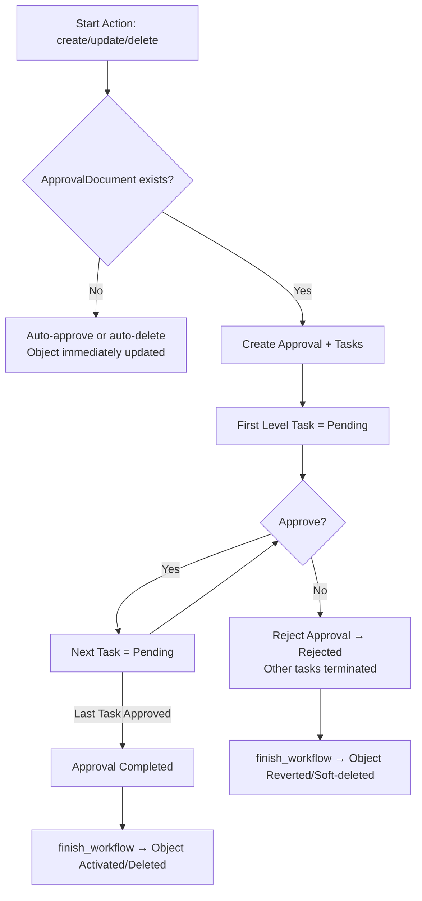

# 🚦 Approval Workflow Documentation

> **Overview**: This document explains how the multi-level approval system works for models that inherit from `BaseApprovableModel`.

---

## 🔑 Core Concepts

The approval system consists of several interconnected components:

### Primary Models

| Model | Purpose |
|-------|---------|
| **Action** | Defines what needs approval (create, update, delete, etc.) |
| **ApproverGroup** | Group of approvers (linked to roles and users) |
| **ApprovalDocument** | Rules for a workflow: Institution + Model + Action |
| **ApprovalDocumentLevel** | A single step (level) in a workflow, with approvers/overriders |
| **Approval** | A workflow instance for a specific object + action |
| **ApprovalTask** | A single level's task inside an Approval |
| **BaseApprovableModel** | Abstract base class for models that need approval (triggers workflow) |

---

## ⚙️ Lifecycle Flow

### 1. 🎯 Trigger
- `confirm_create()` / `confirm_update()` / `confirm_delete()` is called
- `_trigger_approval()` looks up the workflow (`ApprovalDocument`)

### 2. 🛠️ Workflow Setup
- **No workflow configured** → object auto-activated or deleted
- **Workflow exists**:
  - An `Approval` is created
  - `ApprovalTasks` are generated:
    - First task → `pending`
    - Others → `not_started`

### 3. ⚖️ Task Decisions
Approvers handle their task with two possible outcomes:

#### ✅ **Approve**
- Task → `approved`
- Next task → `pending`
- If last task → Approval → `completed`

#### ❌ **Reject**
- Task → `rejected`
- Approval → `rejected`
- Remaining tasks → `terminated`

### 4. 🏁 Finalization
`finish_workflow()` updates the object based on approval status:

| Approval Status | Action | Result on Object |
|----------------|--------|------------------|
| `completed` | **create** | `approval_status="active"`, `is_active=True` |
| `completed` | **update** | `approval_status="active"`, `is_active=True` |
| `completed` | **delete** | `approval_status="under_deletion"`, `is_active=False`, `deleted_at=now()` |
| `rejected` | **create** | `is_active=False`, `deleted_at=now()` (soft-deleted) |
| `rejected` | **update** | `approval_status="active"`, `is_active=True` (revert) |
| `rejected` | **delete** | `approval_status="active"`, `is_active=True` (revert) |

---

## 📊 State Transitions

### 🎯 Object Status (`approval_status`)
- `under_creation` → waiting for confirmation
- `under_update` → waiting for confirmation  
- `under_deletion` → waiting for confirmation
- `active` → fully approved & usable

### 📋 Task Status
- `not_started` → not yet reached
- `pending` → ready for approval
- `approved` → accepted at this level
- `rejected` → denied at this level
- `terminated` → invalid due to rejection elsewhere

---

## 🔄 Workflow Diagram

---

## 📝 Example: Object Creation Workflow

Here's a step-by-step walkthrough of creating an object:

1. **Initiate**: Call `MyModel.confirm_create()`

2. **Lookup**: System finds `ApprovalDocument` for `MyModel` + `create` action

3. **Setup**: Creates `Approval` + tasks (Level 1 = `pending`)

4. **Processing**: 
   - Level 1 approvers approve → Level 2 becomes `pending`
   - Continue until final level

5. **Completion**: Final level approves → Approval = `completed`

6. **Finalization**: `finish_workflow()` sets:
   - `approval_status="active"`
   - `is_active=True`

---

## 💡 Key Takeaways

> **Remember**: The approval workflow ensures proper governance and control over critical operations while maintaining flexibility through configurable approval levels and automatic fallbacks for unconfigured workflows.