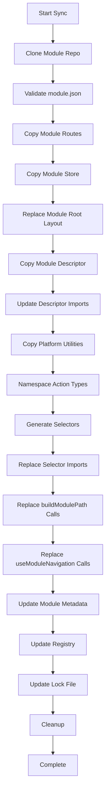

# Host Platform Module Integration Guide

> **Complete Guide to Host Platform Module Integration Architecture**

## Table of Contents

1. [Executive Summary](#executive-summary)
2. [The Challenge](#the-challenge)
3. [Constraints & Solutions](#constraints--solutions)
4. [Architecture Overview](#architecture-overview)
5. [Sync Process Flow](#sync-process-flow)
6. [Scripts & Automation](#scripts--automation)
7. [Module Lifecycle](#module-lifecycle)
8. [Integration Checklist](#integration-checklist)

---

## Executive Summary

**The Goal**: Transform the host platform into a modular system capable of integrating independent Next.js applications as modules, allowing them to run both standalone and integrated.

**Key Achievement**: Created an automated sync process that:

- Clones modules from Git repositories
- Copies files to the correct structure
- Generates context-aware selectors
- Namespaces Redux actions to prevent conflicts
- Updates all imports automatically
- Registers modules in the global Redux store

**Result**: Modules integrate seamlessly without manual intervention, maintain isolation, and work correctly in both standalone and integrated modes.

---

## The Challenge

### Core Problem

Build a modular platform where:

1. **Modules are independent** - Each module is a full Next.js app that can run standalone
2. **Modules integrate seamlessly** - When integrated, they share the host platform's infrastructure
3. **State isolation** - Module state doesn't interfere with host platform state
4. **Automated integration** - No manual steps required during module sync

### Key Constraints

#### 1. **Folder Structure Constraint**

**Challenge**: Next.js App Router has a specific folder structure that must be followed

**Module Structure (Standalone)**:

```
module/
├── app/              # Next.js App Router
│   ├── layout.tsx    # Full HTML structure
│   ├── page.tsx
│   └── (routes)/
├── src/
│   └── store/        # Redux store
└── components/
```

**Host Structure (Integrated)**:

```
host-platform/
├── app/
│   ├── layout.tsx              # Host root layout
│   ├── (main_app)/
│   │   └── (dashboard)/        # Auth checks
│   │       └── apps/           # Module location
│   │           └── module-name/
│   │               ├── layout.tsx        # Simplified
│   │               └── (routes)/
```

**Solution**:

- Modules sync to `app/(main_app)/(dashboard)/apps/{module-name}/`
- Root layout is simplified (no HTML structure)
- Routes are preserved from the module

#### 2. **Routing Constraint**

**Challenge**: Modules use relative routes; in the host, they need the module mount path

**Standalone**: `router.push("/dashboard")` → `/dashboard`  
**Integrated**: `router.push("/dashboard")` → `/apps/task-management/dashboard`

**Solution**:

- Sync script replaces `useModuleNavigation()` calls with mount path
- Replaces `buildModulePath()` calls with hardcoded paths
- Module routes automatically prefixed with `/apps/{module-name}`

#### 3. **State Management Constraint**

**Challenge**: Module and host share Redux, but must remain isolated

**Problem**:

```typescript
// Module dispatches
dispatch(closeSideBar()); // Creates: { type: "misc/CLOSE_SIDE_BAR" }

// Both reducers respond!
miscellaneous: (state, action) => {
	/* Host reducer */
};
taskManagementMisc: (state, action) => {
	/* Module reducer */
};
```

**Solution**:

- Module actions are namespaced during sync
- Host: `misc/CLOSE_SIDE_BAR`
- Module: `taskManagementMisc/CLOSE_SIDE_BAR`
- Each reducer only responds to its own action types

#### 4. **Selector Constraint**

**Challenge**: Module selectors import from `@/store/auth/selectors` which doesn't exist in the host

**Problem**:

```typescript
// Module tries to import
import { selectUser } from "@/store/auth/selectors-context-aware";
// ❌ File doesn't exist in host platform
```

**Solution**:

- Sync script generates module-specific selectors
- Selectors read from namespaced slices
- Imports are replaced to point to generated selectors

#### 5. **Reducer Import Constraint**

**Challenge**: Module descriptor imports reducers from `@/store/...` pointing to host reducers

**Problem**:

```typescript
// Module descriptor
import { authReducer } from "@/store/auth/reducer";
// ❌ Points to host's reducer, not module's
```

**Solution**:

- Copy module's store to `src/lib/modules/{module-name}/store/`
- Update descriptor imports to use module's own store
- Module and host reducers remain isolated

---

## Constraints & Solutions

### Constraint 1: Folder Structure

| **Aspect**         | **Challenge**                  | **Solution**                                         |
| ------------------ | ------------------------------ | ---------------------------------------------------- |
| Next.js App Router | Must follow specific structure | Sync to `app/(main_app)/(dashboard)/apps/`           |
| Module Layout      | Module has full HTML structure | Replace with simple wrapper during sync              |
| File Filtering     | Module has host-specific files | Skip `not-found.tsx`, `globals.css`, `providers.tsx` |
| Module Isolation   | Module and host must coexist   | Separate directory structure                         |

### Constraint 2: Routing

| **Aspect**      | **Challenge**                            | **Solution**                                                        |
| --------------- | ---------------------------------------- | ------------------------------------------------------------------- |
| Navigation Hook | Module uses generic hook                 | Replace with mount path: `useModuleNavigation("/apps/module-name")` |
| Path Building   | Module builds relative paths             | Replace `buildModulePath()` with hardcoded paths                    |
| URL Structure   | Browser needs `/apps/module-name` prefix | Ensure all paths include prefix                                     |

### Constraint 3: State Management

| **Aspect**      | **Challenge**                         | **Solution**                                 |
| --------------- | ------------------------------------- | -------------------------------------------- |
| Action Types    | Module and host share types           | Namespace module actions during sync         |
| Reducers        | Both respond to same actions          | Each reducer listens only to its namespace   |
| Store Structure | Module needs its own reducers         | Copy module store to dedicated location      |
| Selectors       | Module imports non-existent selectors | Generate context-aware selectors during sync |

### Constraint 4: Import Paths

| **Aspect**        | **Challenge**                          | **Solution**                                  |
| ----------------- | -------------------------------------- | --------------------------------------------- |
| Store Imports     | Module imports from `@/store/...`      | Rewrite to `@/lib/modules/{module}/store/...` |
| Hook Imports      | Module imports from `@/hooks/...`      | Ensure hook exists in root `hooks/` directory |
| Component Imports | Module imports from `@/components/...` | Create placeholder components or re-export    |

---

## Architecture Overview

### Host Platform Structure

```
host-platform/
├── app/
│   ├── layout.tsx                          # Root layout (HTML, providers)
│   ├── (main_app)/
│   │   ├── layout.tsx                       # App shell
│   │   └── (dashboard)/
│   │       ├── layout.tsx                   # Auth checks
│   │       └── apps/
│   │           ├── layout.tsx               # Apps container
│   │           └── {module-name}/           # ← Synced modules
│   │               ├── layout.tsx           # Simplified wrapper
│   │               ├── page.tsx
│   │               └── (routes)/            # Module routes
│   └── (other host routes)/                 # Host platform routes
├── src/
│   ├── lib/
│   │   ├── modules/
│   │   │   └── {module-name}/
│   │   │       ├── store/                   # Module's Redux store
│   │   │       ├── selectors.ts             # Generated selectors
│   │   │       └── create-context-aware-selector.ts
│   │   └── redux/
│   │       └── registry.ts                  # Auto-generated Redux registry
│   └── hooks/
│       └── use-module-navigation.ts        # Navigation utilities
├── hooks/                                   # Root-level hooks
│   └── use-module-navigation.ts             # Copied during sync
├── components/                              # Host components
├── store/                                   # Host Redux store
├── scripts/
│   └── sync-module.mjs                     # Main sync script
└── tsconfig.json                            # Path aliases configured
```

### Module Lifecycle

```
┌─────────────────────────────────────────────────────────────────┐
│                         Module Standalone                        │
│                                                                   │
│  Full Next.js App                                                │
│  - Own Redux store                                              │
│  - Own routes                                                   │
│  - Own components                                               │
│  - Own authentication                                           │
└─────────────────────────────────────────────────────────────────┘
                              │
                              │ Synced
                              ▼
┌─────────────────────────────────────────────────────────────────┐
│                      Module Integrated                           │
│                                                                   │
│  - Files synced to app/(main_app)/(dashboard)/apps/            │
│  - Store copied to src/lib/modules/{module}/store/              │
│  - Actions namespaced: misc/ → taskManagementMisc/            │
│  - Selectors generated automatically                            │
│  - Imports updated to point to module location                  │
│  - Reducers registered in global Redux store                    │
└─────────────────────────────────────────────────────────────────┘
```

---

## Sync Process Flow

### High-Level Flow



### Detailed Step-by-Step

#### Step 1: Clone Module Repository

```bash
git clone --depth 1 --branch {tag} {repo} {tempDir}
```

- **Purpose**: Fetch module code at specific version
- **Result**: Temporary directory with module files

#### Step 2: Validate Module Manifest

```javascript
// Read and validate module.json
const manifest = JSON.parse(await fs.readFile("module.json"));
```

- **Checks**:
  - Module name matches
  - Platform version compatibility
  - Required peer dependencies
- **Result**: Validated module descriptor

#### Step 3: Copy Module Routes

```javascript
// Copy src/app/* to app/(main_app)/(dashboard)/apps/{module-name}/
await copyDir(srcAppPath, targetDir);
```

- **What**: Copies all route files (pages, layouts, components)
- **Skips**: `not-found.tsx`, `globals.css`, `providers.tsx`
- **Result**: Module routes synced to host

#### Step 4: Replace Module Root Layout

```javascript
// Replace full HTML layout with simple wrapper
await replaceModuleRootLayout(targetDir);
```

- **From**:
  ```tsx
  export default function RootLayout({ children }) {
  	return (
  		<html>
  			<body>{children}</body>
  		</html>
  	);
  }
  ```
- **To**:
  ```tsx
  "use client";
  export default function AppLayout({ children }) {
  	return <>{children}</>;
  }
  ```
- **Result**: Module uses host platform's HTML structure

#### Step 5: Copy Module Store

```javascript
// Copy src/store/ to src/lib/modules/{module-name}/store/
await copyModuleStoreFiles(tempDir, name, rootDir);
```

- **What**: Copies entire Redux store directory
- **Location**: `src/lib/modules/{module}/store/`
- **Result**: Module's reducers, actions, sagas isolated

#### Step 6: Update Store File Imports

```javascript
// Fix imports in store files
await updateStoreFilesImports(storeDest, moduleName);
```

- **Changes**:
  - `@/lib/redux/create-context-aware-selector`
  - → `@/lib/modules/{module}/store/create-context-aware-selector`
- **Result**: Imports point to correct locations

#### Step 7: Namespace Action Types

```javascript
// msc/CLOSE_SIDE_BAR → taskManagementMisc/CLOSE_SIDE_BAR
await namespaceModuleActionTypes(storeDest, moduleName);
```

- **What**: Updates all action type strings in module
- **Mapping**:
  - `misc/` → `{moduleName}Misc/`
  - `auth/` → `{moduleName}Auth/`
  - `redirects/` → `{moduleName}Redirects/`
  - `notifications/` → `{moduleName}Notifications/`
- **Result**: Module actions isolated from host actions

#### Step 8: Copy Module Descriptor

```javascript
// Copy module descriptor
await fs.copyFile(descriptorSrc, descriptorDest);
```

- **What**: Copy `module-descriptor.ts` from module
- **Location**: `src/lib/modules/{module-name}.ts`
- **Result**: Module metadata available

#### Step 9: Update Descriptor Imports

```javascript
// @/store/auth/reducer → @/lib/modules/{module}/store/auth/reducer
await updateModuleDescriptorImports(descriptorDest, name);
```

- **What**: Rewrites reducer imports to point to module's own store
- **Result**: Descriptor uses module's reducers, not host's

#### Step 10: Copy Platform Utilities

```javascript
// Ensure hooks/use-module-navigation.ts exists
await copyPlatformUtilities(rootDir);
```

- **What**: Copies utility files modules might need
- **Result**: Modules can import platform utilities

#### Step 11: Generate Selectors

```javascript
// Generate context-aware selectors for module
await createContextAwareSelectors(moduleName, moduleDescriptor, rootDir);
```

- **What**: Creates selectors that read from namespaced slices
- **Location**: `src/lib/modules/{module}/selectors.ts`
- **Example**:
  ```typescript
  export const selectUser = (state: RootState) => state.taskManagementAuth?.user?.value;
  ```
- **Result**: Module has working selectors

#### Step 12: Replace Selector Imports

```javascript
// @/store/auth/selectors-context-aware
// → @/lib/modules/{module}/selectors
await replaceSelectorImports(moduleName, targetDir, rootDir);
```

- **What**: Updates all imports in module files
- **Scans**: All `.ts` and `.tsx` files in module
- **Result**: Imports point to generated selectors

#### Step 13: Replace buildModulePath Calls

```javascript
// buildModulePath("/dashboard") → "/apps/module-name/dashboard"
await replaceBuildModulePath(moduleName, targetDir, mountPath, rootDir);
```

- **What**: Replaces function calls with hardcoded paths
- **Result**: Navigation works correctly in integrated mode

#### Step 14: Replace useModuleNavigation Calls

```javascript
// useModuleNavigation() → useModuleNavigation("/apps/module-name")
await replaceBuildModulePath(moduleName, targetDir, mountPath, rootDir);
```

- **What**: Injects mount path into navigation hook calls
- **Result**: Router knows module's mount path

#### Step 15: Update Module Metadata

```javascript
// Save to modules/{module-name}.json
await fs.writeFile(metadataPath, JSON.stringify(metadata));
```

- **What**: Track module version, routes, mount path
- **Result**: Module information persisted

#### Step 16: Update Registry

```javascript
// Generate src/lib/redux/registry.ts
await generateRegistry(rootDir);
```

- **What**: Creates Redux registry combining host and module reducers
- **Result**: Single Redux store with both host and module slices

#### Step 17: Update Lock File

```javascript
// Update modules.lock.json
await fs.writeFile(lockPath, JSON.stringify(lock));
```

- **What**: Track synced modules and versions
- **Result**: Version tracking for modules

#### Step 18: Cleanup

```javascript
// Remove temporary directory
await fs.rm(tempDir, { recursive: true });
```

- **What**: Clean up cloned repository
- **Result**: No leftover files

---

## Scripts & Automation

### Main Script: `sync-module.mjs`

**Location**: `scripts/sync-module.mjs`

**Usage**:

```bash
npm run sync-module -- \
  --repo "https://github.com/org/module-repo" \
  --tag "v1.0.0" \
  --name "module-name"
```

**What It Does**:

1. Clones module from Git repository
2. Validates module manifest
3. Copies files to correct locations
4. Transforms files (replaces imports, namespaces actions)
5. Generates selectors and registry
6. Updates metadata and lock files

**Key Functions**:

| **Function**                      | **Purpose**               | **Result**                         |
| --------------------------------- | ------------------------- | ---------------------------------- |
| `syncModule()`                    | Main orchestration        | Complete module integration        |
| `copyDir()`                       | Copy files with filtering | Files in correct location          |
| `copyModuleStoreFiles()`          | Copy Redux store          | Store isolated in module directory |
| `replaceModuleRootLayout()`       | Simplify layout           | Module uses host HTML structure    |
| `updateModuleDescriptorImports()` | Fix reducer imports       | Descriptor uses module's reducers  |
| `namespaceModuleActionTypes()`    | Namespace actions         | Module actions isolated            |
| `updateStoreFilesImports()`       | Fix store imports         | Imports point to correct files     |
| `createContextAwareSelectors()`   | Generate selectors        | Working selectors for module       |
| `replaceSelectorImports()`        | Replace selector imports  | All files use generated selectors  |
| `replaceBuildModulePath()`        | Replace navigation calls  | Correct routing in integrated mode |
| `replaceModuleNavigation()`       | Inject mount path         | Hook knows module location         |
| `generateRegistry()`              | Create Redux registry     | Unified Redux store                |

### Helper Functions

#### `copyDir(src, dest, rootSrc)`

- **Purpose**: Recursively copy directory
- **Features**:
  - Filters files at root level
  - Skips `not-found.tsx`, `globals.css`, `providers.tsx`
- **Result**: Clean module files in host

#### `findTypeScriptFiles(dir)`

- **Purpose**: Find all `.ts` and `.tsx` files
- **Result**: List of files to process

#### `escapeRegExp(string)`

- **Purpose**: Escape regex special characters
- **Result**: Safe regex patterns

#### `getDirectoryChecksum(dir)`

- **Purpose**: Calculate directory checksum
- **Result**: Version tracking

---

## Module Lifecycle

### Phase 1: Development (Module Team)

```
Module Repository
├── src/
│   ├── app/              # Routes
│   ├── store/            # Redux store
│   └── platform-integration/
│       └── module-descriptor.ts
├── module.json           # Manifest
└── (module code)
```

**Module Team Work**:

- Develop as standalone app
- Export module descriptor
- Tag releases (e.g., `v1.0.0`)

### Phase 2: Sync (Host Platform)

```
Host Platform
├── Runs: npm run sync-module
├── Clones module repo
├── Transforms files
├── Integrates into host
└── Module available at /apps/{module-name}/
```

**Sync Process**:

1. Clone module repository
2. Copy and transform files
3. Generate selectors and registry
4. Update imports and namespaces
5. Register in Redux store

### Phase 3: Runtime (Integrated)

```
Browser
├── Navigation: /apps/{module-name}/dashboard
├── Routes through host layouts
├── Module renders at correct path
└── Redux: Module state isolated
```

**Runtime Flow**:

1. User navigates to module route
2. Host platform's auth checks run
3. Module renders with host infrastructure
4. Module state remains isolated
5. Module actions don't affect host

---

## Integration Checklist

### Pre-Sync Preparation

- [ ] Module has `module.json` manifest
- [ ] Module has `module-descriptor.ts`
- [ ] Module uses standard Redux structure
- [ ] Module has git tags for versioning
- [ ] Module exports required components

### Sync Execution

- [ ] Run sync command with correct parameters
- [ ] Verify module files copied to `app/`
- [ ] Verify module store copied to `src/lib/modules/`
- [ ] Check action types are namespaced
- [ ] Check selectors are generated
- [ ] Check imports are updated
- [ ] Check registry is generated

### Post-Sync Verification

- [ ] Module accessible at `/apps/{module-name}`
- [ ] Routes render correctly
- [ ] Redux state isolated
- [ ] Actions don't affect host
- [ ] Selectors return correct values
- [ ] No build errors
- [ ] No TypeScript errors

### Testing

- [ ] Navigate to module routes
- [ ] Test module functionality
- [ ] Verify sidebar toggle only affects module
- [ ] Check module-specific features work
- [ ] Verify host features still work
- [ ] Test browser navigation

---

## Summary

### What We Achieved

✅ **Automated Module Integration** - No manual steps required  
✅ **State Isolation** - Module and host don't interfere  
✅ **Action Namespacing** - Module actions are unique  
✅ **Selector Generation** - Working selectors generated automatically  
✅ **Import Replacement** - All imports updated to correct paths  
✅ **Routing Support** - Module routes work in integrated mode  
✅ **Store Isolation** - Module has its own Redux store  
✅ **Registry Management** - Unified store with both host and module

### Key Architecture Decisions

1. **Module Location**: `app/(main_app)/(dashboard)/apps/{module}/`
2. **Store Location**: `src/lib/modules/{module}/store/`
3. **Selector Location**: `src/lib/modules/{module}/selectors.ts`
4. **Action Namespacing**: `{moduleName}Slice/ACTION_TYPE`
5. **Navigation**: Mount path injected during sync
6. **Layout**: Simplified during sync (uses host HTML)

### The Complete Flow

```
Module Repository (v1.0.0)
         │
         ▼
   sync-module.mjs
         │
         ├─► Clone & Validate
         ├─► Copy & Transform
         ├─► Namespace Actions
         ├─► Generate Selectors
         ├─► Update Imports
         └─► Register in Redux
         │
         ▼
   Host Platform
         │
         ├─► app/apps/{module}/
         ├─► src/lib/modules/{module}/store/
         ├─► src/lib/modules/{module}/selectors.ts
         └─► src/lib/redux/registry.ts
         │
         ▼
   Runtime
         │
         ├─► User: /apps/{module}/dashboard
         ├─► Host: Auth checks pass
         ├─► Module: Renders content
         └─► Redux: State isolated
```
